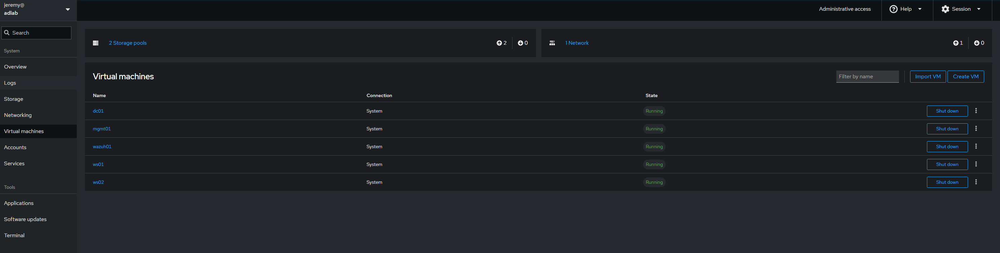
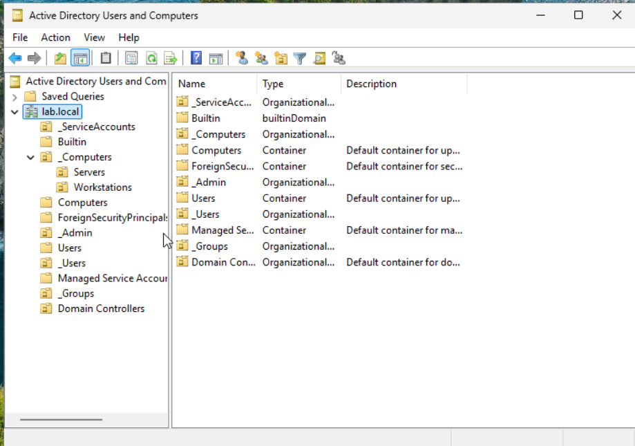
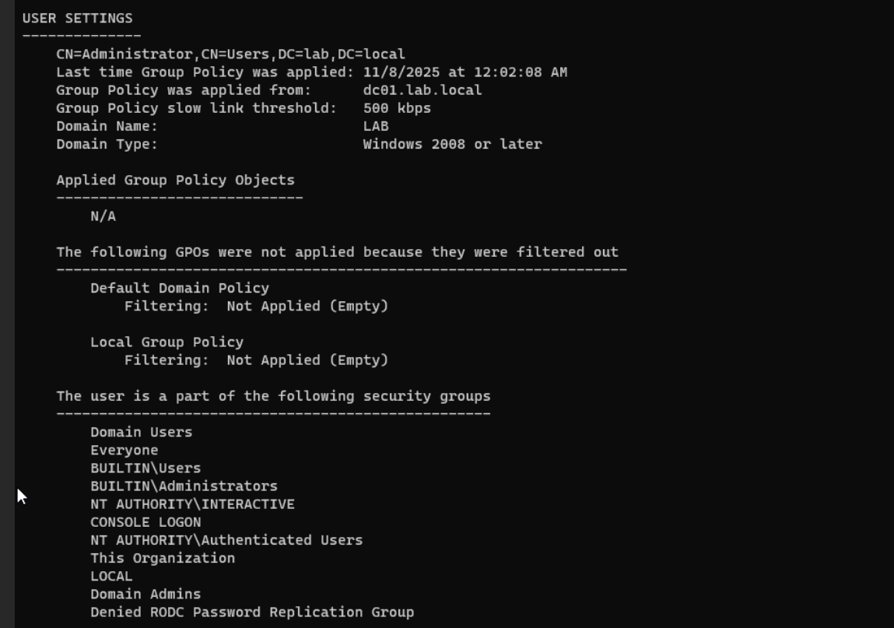
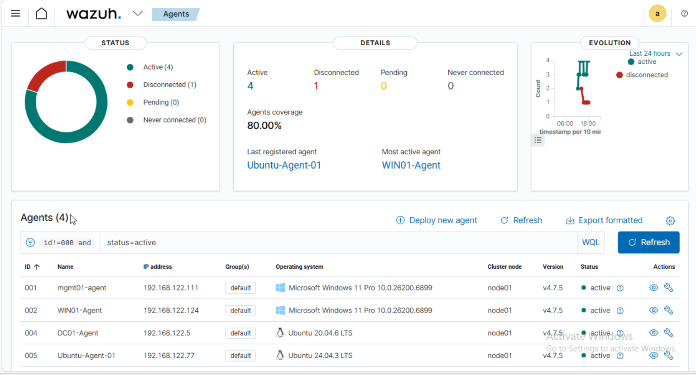
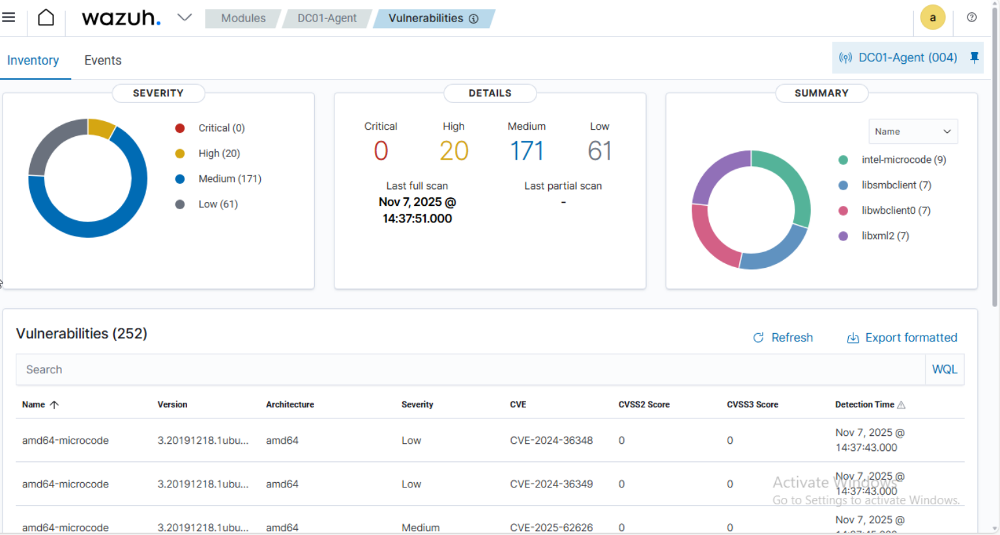
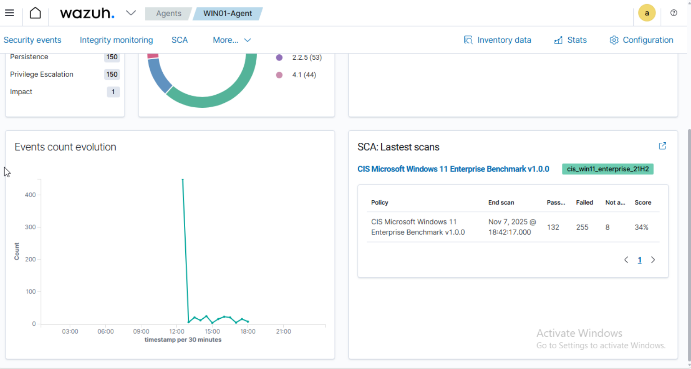
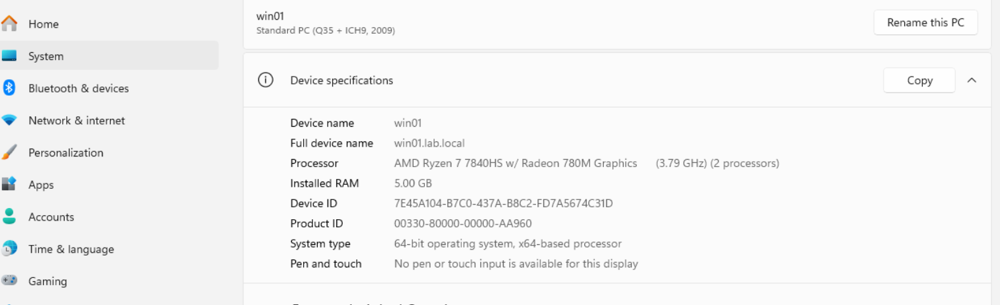
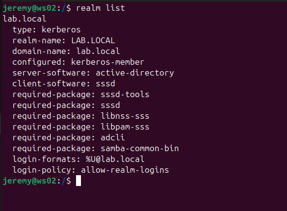

# Home Lab: Samba AD DC + Windows RSAT + Wazuh

- Host: Ubuntu + libvirt/KVM (Cockpit), NAT virbr0 (192.168.122.0/24)
- dc01: Samba AD DC (192.168.122.5) for LAB.LOCAL
- mgmt01: Windows 11 Pro with RSAT
- ws02: Windows 11 Pro (domain member)
- ws01: Ubuntu Desktop (domain member)
- Wazuh: single-node (manager + indexer + dashboard v4.7.5)
- Agents: mgmt01-agent, WIN01-Agent, DC01-Agent, WS02-Agent

## Build Summary
1. Samba AD on dc01
2. RSAT on mgmt01 + first GPO
3. Wazuh single-node + agents

## Pitfalls
- samba-ad-dc masked
- old smb.conf blocking provision
- DNS SERVFAIL until forwarder set
- libvirt pool space (LVM)
- agent purge via API
## Requirements & Versions
- Host OS: Ubuntu (libvirt/KVM, Cockpit)
- Network: libvirt default NAT `virbr0` (192.168.122.0/24)
- Domain: `LAB.LOCAL`
- DC IP: `dc01` → **192.168.122.5**
- Wazuh Dashboard: **v4.7.5**
- Windows admin box: `mgmt01` (Windows 11 Pro with RSAT)

## VM Inventory (final state)
- `dc01` — Ubuntu Server, Samba AD DC (LAB.LOCAL), DNS forwarder → 1.1.1.1
- `mgmt01` — Windows 11 Pro, RSAT (ADUC, DNS, GPMC)
- `ws02` — Windows 11 Pro, joined to domain
- `ws01` — Ubuntu Desktop, joined to domain

## Status (checks)
- AD DS online; SRV records resolve; Kerberos tickets issued (Administrator).
- RSAT from `mgmt01` works; first GPO linked to `Workstations` OU.
- Wazuh single-node running; Vulnerability Detector cycles complete.
- Agents reporting: `mgmt01-agent`, `WIN01-Agent`, `DC01-Agent`, `WS02-Agent`.

## Status (final)
- AD DS online; SRV records resolve; Kerberos tickets issued (Administrator).
- RSAT from `mgmt01` works; first GPO linked to `Workstations` OU.
- Wazuh single-node running; Vulnerability Detector cycles complete.
- Agents reporting: `mgmt01-agent`, `WIN01-Agent`, `DC01-Agent`, `WS02-Agent`.

## Issues Resolved (during build)
- `samba-ad-dc` was masked → unmasked and enabled.
- Provision failed due to existing `/etc/samba/smb.conf` → moved and re-provisioned to regenerate.
- DNS SERVFAIL on `dc01` → set Samba DNS forwarder to `1.1.1.1`.
- Wazuh agent on `WS02` initially showed no SCA/vulns → purged via REST API with `purge=true&force=true`, then reinstalled.

## Screenshots

